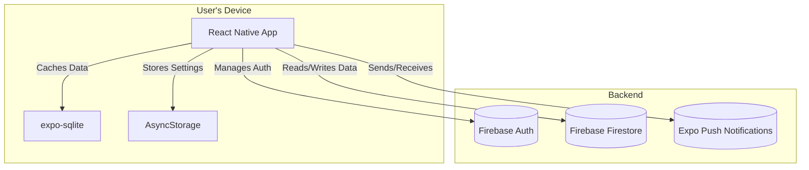

# HealthUp: Mobile Health Tracker

## Project Aim
HealthUp is a comprehensive, full-stack mobile health tracking application. It provides users with a secure platform to log in, monitor various health metrics, visualize their data over time, and connect with other users for support and accountability.

## Technical Implementation
The application is built with React Native and Expo, using TypeScript for a robust, type-safe codebase. It employs a sophisticated architecture that includes:
- **Firebase Backend:** User authentication is handled by Firebase Auth, and data is stored and synced with Firestore.
- **Local Data Persistence:** Utilizes both `expo-sqlite` and `AsyncStorage` for offline data access and caching.
- **Modern UI:** The user interface is built with React Native Paper, following Material Design principles.
- **Data Visualization:** Health data is rendered into meaningful graphs and charts using `react-native-chart-kit`.
- **Navigation:** It uses Expo Router to manage a tab-based navigation system protected by an authentication flow.

## Key Features
- **Secure User Authentication:** Full login and registration system powered by Firebase.
- **Health Data Visualization:** Interactive plots and charts to help users understand their health trends.
- **Social Connectivity:** A "Connected Users" feature allows for social interaction and data sharing.
- **Push Notifications:** Capable of sending reminders or alerts to users via `expo-notifications`.

## Setup Instructions

- **Install dependencies:** `npm install`

- **Run the app:** `npx expo start`

## System Diagram

